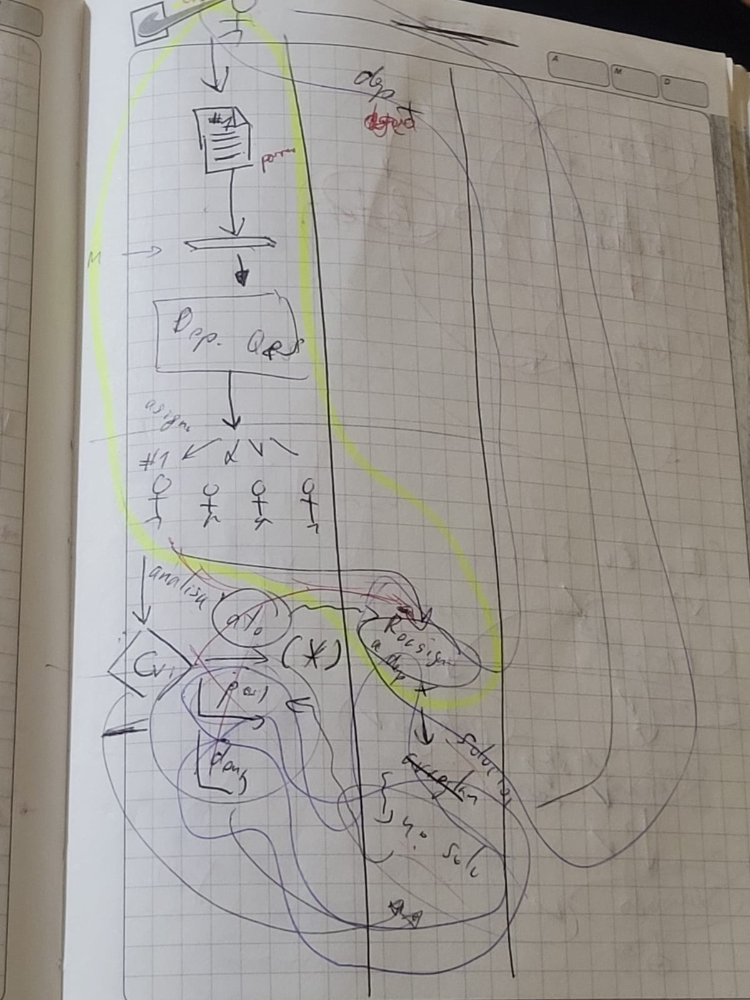
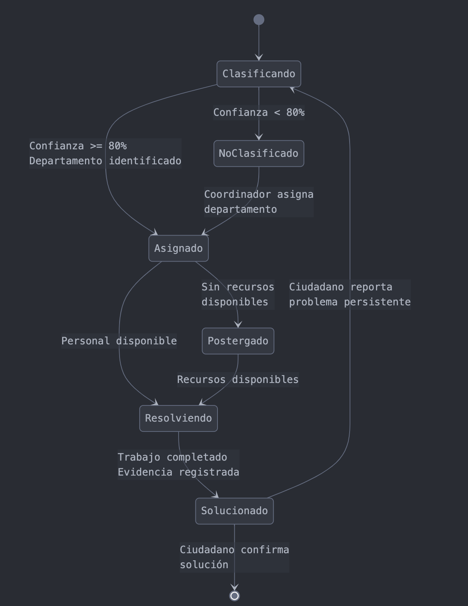

# Desarrollo del feature
### Fecha: 04 enero del 2025 - 22 enero del 2025
## 1. Descripción del Feature

**Nombre:** Manejar y gestionar problemas urbanos  
**Descripción:**  
Este feature tiene como objetivo mejorar la gestión de reportes de problemas urbanos dentro de una entidad municipal. Se enfoca en optimizar el flujo de asignación, atención y resolución de incidentes reportados por los ciudadanos, asegurando una administración eficiente de los recursos disponibles y garantizando una respuesta oportuna a cada solicitud.

---

## 2. Estudio del proceso de manejo de reportes

Para comprender y modelar adecuadamente el flujo de gestión de reportes, se realizó un **análisis detallado del proceso dentro de la entidad municipal**. A través de una abstracción del flujo de trabajo, se identificaron las principales etapas involucradas en la recepción, asignación y resolución de los reportes ciudadanos.

📌 **Referencia**: 

### **2.1. Etapas del proceso de manejo de reportes**
A partir del estudio del proceso, se identificaron los siguientes pasos clave:

1. **Recepción del reporte:**  
   - Los ciudadanos reportan problemas urbanos a través de la aplicación.  
   - Se capturan datos como la ubicación, descripción e imágenes del incidente.  

2. **Departamento de quejas:**  
   - Recibe y registra el reporte en el sistema.  
   - Evalúa la información para determinar su validez.  
   - Asigna el reporte al departamento correspondiente según el tipo de problema.  

3. **Departamento asignado:**  
   - Evalúa si hay recursos disponibles para atender el problema.  
   - Si los recursos están disponibles, se procede a la atención del problema.  
   - Si no hay recursos, el reporte se **postergará** hasta que haya disponibilidad.  

4. **Postergados:**  
   - Los reportes en esta categoría se revisan periódicamente para determinar si pueden ser atendidos.  
   - No pueden volver a ser asignados manualmente, ya que permanecen en el sistema hasta que haya recursos para resolverlos.  

---

## 3. Primera propuesta de escenarios del feature

Basado en los pasos extraídos del proceso de manejo de reportes, se formularon los primeros escenarios de este feature. Estos escenarios buscan representar las diferentes situaciones en las que un reporte puede ser procesado dentro del sistema.

📌 **Referencia**: [Primera propuesta de los escenarios del Feature](anexos.md#escenarios-primera-propuesta)  

---

## 4. Enfoque de los escenarios en máquina de estados

Otra técnica utilizada para el desarrollo de los escenarios del feature fue la modelación mediante **máquinas de estado**. Este enfoque permite representar el comportamiento del sistema en función de los eventos que recibe y las transiciones entre distintos estados.

📌 **Referencia**: [Estudio del proceso de manejo de reportes](#2-estudio-del-proceso-de-manejo-de-reportes)  

### **4.1. Metodología utilizada**
1. **Identificación de estados clave**  
   - Se analizaron los diferentes momentos en los que se encuentra un reporte dentro del sistema.  
   - Se establecieron los estados con base en la evolución del reporte desde su creación hasta su resolución.  

2. **Definición de transiciones**  
   - Se identificaron las condiciones que permiten pasar de un estado a otro.  
   - Se establecieron restricciones para evitar transiciones inválidas.  

3. **Modelado gráfico de la máquina de estados**  
   - Se creó un diagrama visual que representa las transiciones y estados del sistema.  
   - Se utilizó notación estándar para la representación de estados y eventos.  

### **4.2. Estados y transiciones de los reportes**
Los reportes dentro del sistema de manejo de incidencias pueden encontrarse en los siguientes estados:

- **Clasificando** → Evaluando la información para determinar su categoría.  
- **NoClasificado** → Reportes sin suficiente información o pendientes de revisión.  
- **Asignado** → Reportes que han sido enviados a un departamento específico.  
- **Postergado** → Reportes que no pueden atenderse en el momento por falta de recursos.  
- **Resolviendo** → Reportes que están siendo atendidos por el equipo correspondiente.  
- **Solucionado** → Reportes que han sido resueltos satisfactoriamente.  

Cada uno de estos estados tiene transiciones bien definidas, las cuales pueden observarse en el siguiente diagrama:

📌 **Referencia visual**:  
  

---

## 5. Segunda propuesta de escenarios del feature

Para la segunda propuesta de escenarios, se tomó en cuenta el modelo de **máquina de estados** anteriormente definido. Se diseñaron escenarios en función de cada transición entre estados, es decir, se estableció un escenario por cada cambio de estado del reporte.  

📌 **Referencia**: [Segunda propuesta de escenarios](anexos.md#escenarios-segunda-propuesta)  

### **5.1. Evaluación de la segunda propuesta**
Después de implementar esta propuesta, se identificó que modelar un escenario por cada transición no era la mejor opción, ya que:
- Algunas transiciones no representaban **eventos significativos para el usuario**.  
- La granularidad de los escenarios se volvió demasiado detallada, generando redundancias en las pruebas.  
- Se detectó que era más eficiente agrupar algunas transiciones dentro de un mismo escenario en lugar de separarlas en eventos individuales.  

Por lo tanto, se decidió ajustar nuevamente la propuesta de escenarios para optimizar la claridad y eficiencia del modelo.

---
## 6. Propuesta final de escenarios del feature

### 6.1. Optimización de la máquina de estados

En esta fase, se realizó una simplificación de la **máquina de estados** con el objetivo de optimizar el flujo de trabajo y eliminar transiciones innecesarias. A partir del análisis previo, se decidió reducir el número de estados a los siguientes:

- **no_asignado** → Reporte recibido pero aún no asignado a un departamento.
- **asignado** → Reporte asignado a un departamento para ser atendido.
- **postergado** → Reporte que no pudo ser atendido de inmediato por falta de recursos.
- **resuelto** → Reporte que ha sido atendido y solucionado.

Esta reducción permitió una gestión más eficiente de los reportes y una implementación más clara de los escenarios en el sistema.

### 6.2. Enfoque en la definición de escenarios

Para garantizar una cobertura efectiva del feature, se definieron escenarios que reflejan la interacción de los reportes con los departamentos responsables. Se mantuvo un enfoque en la **automatización de la asignación, la priorización de reportes y la documentación de la resolución de incidentes**.

A continuación,se presentan los nuevos escenarios del feature.

[Escenarios finales del Feature](anexos.md#escenario-propuesta-final)

---

