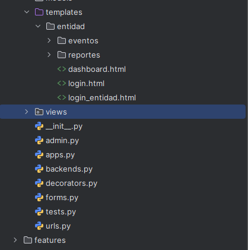
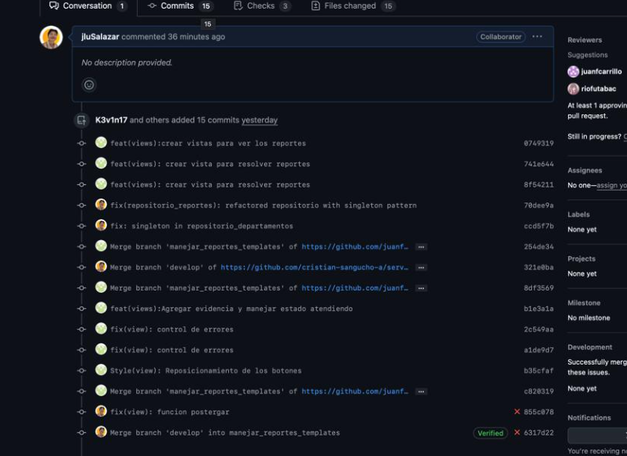
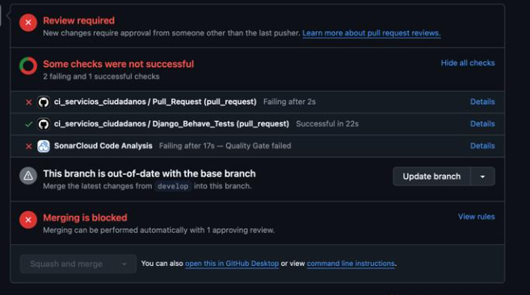
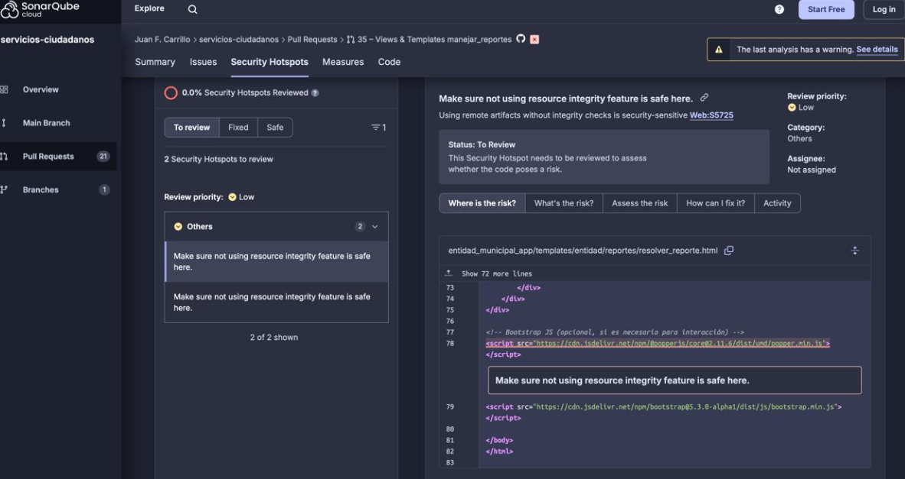

# Proyecto Django 

# 1.  Estructura del código 
Para el desarrollo del proyecto en Django, se optó por una arquitectura modular basada en apps independientes. Cada app agrupa funcionalidades específicas y está asignada a un equipo de trabajo, facilitando la escalabilidad, el mantenimiento y la colaboración entre desarrolladores.

[Estructura detallada del proyecto](anexos.md#estructura-del-proyecto)

##  ** Estructura general**
El sistema está dividido en **apps** independientes:

- **`ciudadano_app/`** → Registros, reservas, notificaciones.
- **`entidad_municipal_app/`** → Eventos, reportes, canales informativos.
- **`shared/`** → Modelos y funciones compartidas (ciudades, sectores, reportes).
- **`servicios_ciudadanos/`** → Configuración principal del proyecto.
- **`theme/`** → Frontend con **TailwindCSS**.
- **`features/`** → Pruebas BDD con **Behave**.
- **`mocks/`** → Repositorios en memoria para pruebas.

##  ** Principales funcionalidades**

## ** Manejo de reportes ciudadanos **
✅ Clasificación y asignación automática de reportes.
✅ Priorización de reportes según su asunto.
✅ Registro de evidencias de soluciones.
✅ Gestión del estado de los reportes: no asignado, asignado, postergado, resuelto.

## ** Gestión de departamentos municipales**
✅ Asignación y atención de reportes por departamentos.
✅ Registro de soluciones y cambios de estado de los reportes.
✅ Postergación y atención posterior de reportes.

# Dependencias del proyecto 
- `Django` → Framework principal del backend.  
- `django-tailwind==3.7.0` → Integración de **TailwindCSS** en Django.    
   
##  Pruebas y calidad de código
- `behave==1.2.7.dev6` → Pruebas basadas en **BDD** (Behavior-Driven Development).  
- `behave-django==1.5.0` → Integración de **Behave** con Django.  

##  Generación de datos de prueba
- `Faker==35.0.0` → Generador de datos falsos para pruebas. 

## 2. Base de datos (Migraciones)

En la implementación del proyecto, se utilizó el sistema de migraciones de Django junto con la base de datos SQLite para gestionar de manera eficiente la estructura de la base de datos. Django facilita el manejo de cambios en los modelos a través de un sistema de migraciones automáticas. Cada vez que se realiza una modificación en los modelos, Django genera archivos de migración, que son secuenciales y reflejan los cambios realizados en la estructura de la base de datos.

Para aplicar estos cambios, se utilizan los comandos makemigrations y migrate. El comando makemigrations se encarga de detectar y crear los archivos de migración necesarios para reflejar las modificaciones en los modelos, mientras que el comando migrate aplica dichas migraciones a la base de datos, asegurando que la estructura de la base de datos esté siempre actualizada. Este enfoque de migraciones no solo simplifica la gestión de los cambios, sino que también facilita el control de versiones de la base de datos, permitiendo revertir cambios si es necesario y mantener la integridad de los datos a lo largo del ciclo de vida del proyecto.

## 3.  Front end con Html y css

Para gestionar las vistas en Django, se aprovechó su enfoque simplificado para el manejo de plantillas. El código HTML y CSS se organizó en una estructura modular, donde los archivos HTML y CSS se ubicaron dentro de una carpeta llamada templates. La lógica de los controladores, por su parte, se organizó en una carpeta separada llamada views, la cual se subdividió en carpetas específicas para diferentes funcionalidades del sistema, como reportes y eventos. Esta estructura se definió de manera independiente para cada una de las aplicaciones del proyecto, facilitando la gestión y el mantenimiento del código.

# 4. Gestión de versionado y buenas prácticas en commits

Durante el desarrollo del proyecto, se siguió una metodología estructurada para el control de versiones, asegurando que cada cambio quedara correctamente documentado en el repositorio. Para ello, se cumplió con el uso de mensajes descriptivos en los commits, los cuales reflejan claramente las modificaciones realizadas en cada etapa. Esto permitió mantener un historial de cambios comprensible, facilitando la revisión del código, la detección de errores y la colaboración dentro del equipo. Además, se utilizaron convenciones de nomenclatura para identificar si un commit correspondía a una nueva funcionalidad, una corrección de errores o una mejora en el código existente.

# 5. Integracion continua y SonarQube
Antes de integrar los cambios en la rama develop, cada actualización pasó por un proceso de Integración Continua (CI), donde se ejecutaron pruebas automatizadas y análisis de calidad de código mediante SonarQube. Solo después de superar estas validaciones, un revisor evaluaba el código y aprobaba el Pull Request, asegurando que cada contribución cumpliera con los estándares definidos antes de ser fusionada en la rama principal del desarrollo.

Integracion continua 

SonarQube
