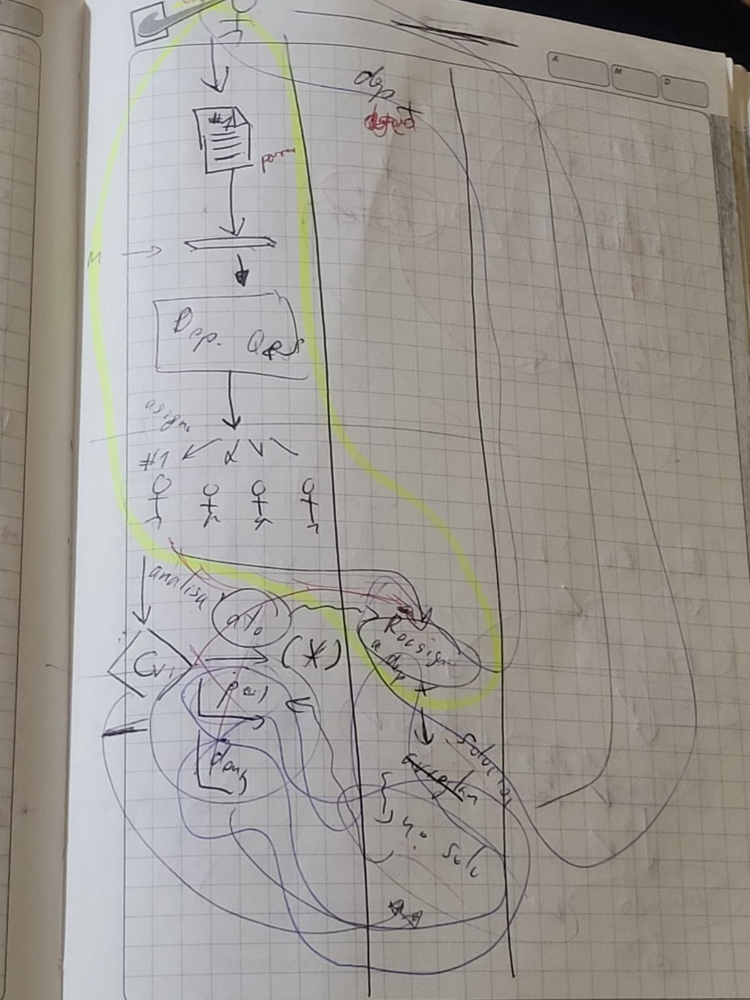

# Anexos de verificación
## Kanban de features


## Escenarios primera propuesta
```gherkin
Esquema del escenario: Escenario: Atender reporte notificado
    Dado un empleado público "<nombre_empleado>" está trabajando en el sistema
    Y el estado "<estado_actual>" del reporte "<nombre_reporte>" es por revisar o postergado
    Cuando se cambia el estado del reporte "<nombre_reporte>" a por atender
    Entonces se envia una notificación al equipo de atención correspondiente "<departamento>" para inciar el proceso de solución del reporte
    Y notifica al ciudadano "<nombre_ciudadano>" que el problema será tratado inmediatamente


     Ejemplos: Reportes críticos
    | nombre_empleado | nombre_reporte          | estado_actual  | departamento                     | nombre_ciudadano |
    | Juan Pérez      | Fuga de agua            | por revisar    | Departamento de Obras            | Marcela          |
    | María Gómez     | Corte de electricidad   | postergado     | Departamento de Energía          | Carlos           |
    | Lucía Martínez  | Bache en carretera      | por revisar    | Departamento de Transporte       | Julio            |
    | Pedro López     | Problema de alumbrado   | postergado     |  Departamento de Infraestructura | Andres           |

  Esquema del escenario: Escenario:  Postergar reporte notificado
    Dado un empleado público "<nombre_empleado>" está trabajando en el sistema
    Y el estado "<estado_actual>" del reporte "<nombre_reporte>" es por revisar
    Cuando se cambia el estado del reporte "<nombre_reporte>" a postergado
    Entonces se muestra una notificación después de "<dias>" días definidos por el empleado para recordarle revisar el reporte postergado
    Y notifica al ciudadano "<nombre_ciudadano>" que el problema será tratado según la disponibilidad de recursos

    Ejemplos: Reportes con prioridad baja
    | nombre_empleado | nombre_reporte           | estado_actual | dias | nombre_ciudadano|
    | Luis Mejía      | Ruido en el vecindario   | por revisar   | 5    | Ana             |
    | Elena Torres    | Contenedor lleno         | por revisar   | 3    | Mario           |
    | Francisco Vega  | Árbol caído en parque    | por revisar   | 7    | Laura           |
    | Marta Cruz      | Basura en la acera       | por revisar   | 2    | Jaime           |

  Esquema del escenario: Denegar reporte notificado
  Dado un empleado público "<nombre_empleado>" está trabajando en el sistema
    Y el estado "<estado_actual>" del reporte "<nombre_reporte>" es por revisar
    Cuando se cambia el estado del reporte "<nombre_reporte>" a denegado
    Entonces se notifica al ciudadano "<nombre_ciudadano>"  que el reporte no se encuentra bajo la jurisdicción de la institución pública

    Ejemplos: Reportes fuera de jurisdicción
    | nombre_empleado | nombre_reporte            | estado_actual | nombre_ciudadano|
    | Carolina Ramos  | Corte de internet         | por revisar   | Fernando        |
    | Andrés Silva    | Servicio telefónico caído | por revisar   | Adriana         |
    | Rosa Díaz       | Problema con cableado TV  | por revisar   | Javier          |
    | Daniel Ortega   | Entrega de correspondencia| por revisar   | Luisa           |

```

## Proceso de manejo de reportes


## Escenarios segunda propuesta
```gherkin
Esquema del escenario: Clasificación automática de reporte ciudadano
    Dado un nuevo reporte ciudadano
    Cuando el sistema analiza el problema reportado "<descripcion_reporte>"
    Y encuentra coincidencias con el departamento "<departamento>"
    Y el nivel de confianza es "<confianza>"%
    Entonces el reporte se clasifica como "asignado"
    Y se asigna al departamento "<departamento>"

    Ejemplos:
      | descripcion_reporte         | departamento       | confianza |
      | Bache en la calle           | Obras Públicas     | 95        |
      | Luminaria pública dañada    | Alumbrado Público  | 90        |
      | Acumulación de basura       | Limpieza Pública   | 85        |
      | Árbol caído                 | Parques y Jardines | 92        |

  Esquema del escenario: Fallo en clasificación automática
    Dado un nuevo reporte ciudadano con problema "<problema>"
    Cuando el sistema no puede determinar el departamento responsable ya que el nivel de confianza es menor a 80%
    Entonces el reporte se marca como "noClasificado"
    Y requiere revisión del coordinador municipal

    Ejemplos:
      | problema                          |
      | Ruidos molestos intermitentes     |
      | Problema con vecino comerciante   |
      | Actividad sospechosa en el barrio |

  Esquema del escenario: Clasificación manual por coordinador
    Dado un reporte "noClasificado"
    Cuando el coordinador municipal asigna el departamento "<departamento>"
    Y registra la justificación "<justificacion>"
    Entonces el reporte cambia a "asignado"
    Y el sistema aprende los criterios de clasificación

    Ejemplos:
      | departamento          | justificacion                               |
      | Fiscalización         | Requiere inspección por licencia comercial  |
      | Seguridad Ciudadana   | Necesita patrullaje y monitoreo            |
      | Desarrollo Social     | Caso requiere evaluación social             |

  Esquema del escenario: Inicio de atención del problema
    Dado un reporte "asignado" al departamento "<departamento>"
    Cuando el departamento tiene personal disponible
    Entonces el reporte cambia a "resolviendo"
    Y se notifica al ciudadano

    Ejemplos:
      | departamento       |
      | Obras Públicas     |
      | Alumbrado Público  |
      | Limpieza Pública   |

  Esquema del escenario: Postergación de atención
    Dado un reporte "asignado"
    Cuando el departamento "<departamento>" no tiene recursos disponibles
    Entonces el reporte cambia a "postergado"
    Y se registra el motivo "<motivo>"
    Y se comunica nueva fecha estimada "<fecha_estimada>"

    Ejemplos:
      | departamento      | motivo                           | fecha_estimada|
      | Obras Públicas    | Maquinaria en mantenimiento      | 3 días        |
      | Parques y Jardines| Personal en emergencia climática | 2 días        |
      | Limpieza Pública  | Camiones en otra zona prioritaria| 1 día         |

  Esquema del escenario: Retomar problema postergado
    Dado un reporte "postergado"
    Cuando el departamento "<departamento>" tiene recursos disponibles
    Entonces el reporte cambia a "resolviendo"
    Y se notifica al ciudadano el inicio de trabajos

    Ejemplos:
      | departamento     |
      | Obras Públicas   |
      | Limpieza Pública |

  Esquema del escenario: Resolución del problema ciudadano
    Dado un reporte en "resolviendo"
    Cuando el personal registra:
      | acción realizada  | "<accion>"     |
      | evidencia         | "<evidencia>"   |
      | tiempo empleado   | "<tiempo>"      |
    Y adjunta fotos del trabajo realizado
    Entonces el reporte cambia a "solucionado"
    Y se solicita confirmación al ciudadano

    Ejemplos:
      | accion                    | evidencia                | tiempo    |
      | Reparación de bache      | Fotos antes y después    | 5 horas   |
      | Recolección de residuos  | Foto área limpia         | 45 min    |
      | Poda de árbol            | Fotos del trabajo        | 2 horas   |

  Esquema del escenario: Reapertura de reporte ciudadano
    Dado un reporte "solucionado"
    Cuando el ciudadano indica que el problema persiste
    Y proporciona nueva evidencia fotográfica "<evidencia>"
    Y describe el problema persistente "<descripcion>"
    Entonces el reporte vuelve a "clasificando"

    Ejemplos:
      | evidencia              | descripcion                               |
      | Foto de bache         | La reparación del bache se está hundiendo |
      | Foto de luminaria     | La luz volvió a apagarse                  |
      | Foto de basura        | Siguen acumulando basura en el punto      |
    
```
## Escenario propuesta final
```gherkin
Característica: Manejar los reportes ciudadanos
    Como entidad publica,
    quiero clasificar, atender y posponer los reportes enviados por los ciudadanos,
    para asignar recursos de manera eficiente y solucionar los problemas en el menor tiempo posible.


    Escenario: Resolver reportes asignados a un departamento
        Dado nuevos reportes que llegan al gestor de departamentos
        | nombre     | correo              | identificacion | asunto       | descripcion | ubicacion | cantidad_registro | prioridad |
        | Juan Perez | juan.perez@test.com | 1727263717     | inundacion   | Se inundo   | Av. 123   | 13                | 1         |
        | Juan Perez | juan.perez@test.com | 1727263717     | incendio     | Se inundo   | Av. 123   | 8                 | 2         |
        Y los reportes han sido asignados automáticamente a un departamento
        Y los reportes son priorizados por su asunto
        Cuando el departamento "EPMMOP" atienda el reporte "1"
        Entonces el departamento registra la evidencia "Basura recogida" de la solución del reporte atendido
        Y el estado del reporte atendido cambia a "resuelto"


    Escenario: Resolver reportes postergados de un departamento
        Dado nuevos reportes que llegan al gestor de departamentos
        Y el departamento "EPMMOP" posterga el reporte "2"
        Cuando el departamento "EPMMOP" atienda el reporte "2"
        Entonces el departamento registra la evidencia "Se ha rellenado el bache" de la solución del reporte atendido
        Y el estado del reporte atendido cambia a "resuelto"
```

## Steps propuesta final
```gherkin
"""
Este módulo contiene los pasos definidos para las pruebas de comportamiento
utilizando Behave.
"""
from behave import *

from app.Reporte import Reporte
from app.GestorDeDepartamentos import GestorDeDepartamentos
from app.Departamento import Departamento


#use_step_matcher("re")

#Escenario 1.1
@step('los siguientes reportes ciudadanos llegan al gestor de departamentos')
def step_impl(context):
    """
    :type context: behave.runner.Context
    """
    context.gestor_de_departamentos = GestorDeDepartamentos()

    context.gestor_de_departamentos = GestorDeDepartamentos()
    for row in context.table:
        reporte = Reporte(row["id_reporte"], row["descripcion_reporte"])
        context.gestor_de_departamentos.agregar_nuevo_reporte_no_asignado(reporte)
    pass


@step('los reportes han sido asignados automáticamente a un departamento')
def step_impl(context):
    """
    :type context: behave.runner.Context
    """

    context.gestor_de_departamentos.asignar_automaticamente_reportes_a_departamentos()
    pass


@step('el departamento "{nombre_departamento}" priorice los reportes asignados')
def step_impl(context, nombre_departamento):
    """
    :type nombre_departamento: str
    :type context: behave.runner.Context
    """
    context.departamento = context.gestor_de_departamentos.obtener_departamento_por_nombre(nombre_departamento)
    context.departamento.priorizar_reportes()
    pass


@step('el departamento atienda el reporte "{id_reporte_atendido}"')
def step_impl(context, id_reporte_atendido):
    """
    :type id_reporte_atendido: str
    :type id_reporte_atendido: str
    :type context: behave.runner.Context
    """
    context.reporte_atendido = context.departamento.obtener_reporte_por_id(id_reporte_atendido)
    context.departamento.atender_reporte(context.reporte_atendido)
    assert "atendiendo" == context.reporte_atendido.obtener_estado() , "El reporte no está siendo atendido"


@step("el departamento registra la evidencia {descripcion_evidencia} de la solución del reporte atendido")
def step_impl(context, descripcion_evidencia):
    """
    :type descripcion_evidencia: str
    :type context: behave.runner.Context
    """
    context.departamento.registrar_evidencia(context.reporte_atendido, descripcion_evidencia)
    assert "" != context.reporte_atendido.obtener_evidencia(), \
        "El reporte {context.reporte_atendido.obtener_id()} no tiene la evidencia registrada."


@step('el estado del reporte atendido cambia a "resuelto"')
def step_impl(context):
    """
    :type context: behave.runner.Context
    """
    context.reporte_atendido.cambiar_estado("resuelto")
    assert context.reporte_atendido.obtener_estado() == "resuelto", \
        f"El estado del reporte {context.reporte_atendido.obtener_id()} no se actualizó correctamente."

#Escenario 2.1
@step('el departamento "{nombre_departamento}" posterga el reporte "{id_reporte_postergado}"')
def step_impl(context, nombre_departamento, id_reporte_postergado):
    """
    :param nombre_departamento:
    :type id_reporte_postergado: str
    :type context: behave.runner.Context
    """
    context.departamento = context.gestor_de_departamentos.obtener_departamento_por_nombre(nombre_departamento)
    context.reporte_postergado = context.departamento.obtener_reporte_por_id(id_reporte_postergado)
    context.departamento.postergar_reporte(context.reporte_postergado)
    assert context.reporte_postergado.obtener_estado() == "postergado", \
        f"El estado del reporte {context.reporte_postergado.obtener_id()} no se actualizó correctamente."


#Escenrio 3.1
@step('los reportes no han sido asignados a ningún departamento')
def step_impl(context):
    """
    :type context: behave.runner.Context
    """
    reportes_no_asignados = context.gestor_de_departamentos.obtener_reportes_no_asignados()
    assert len(reportes_no_asignados) > 0, "Todos los reportes han sido asignados automáticamente."

@step('se realiza una asignación manual del reporte "{id_reporte}" al departamento "{departamento}"')
def step_impl(context, id_reporte, departamento):
    """
    :type id_reporte: str
    :type departamento: str
    :type context: behave.runner.Context
    """

    reporte_no_asignado = context.gestor_de_departamentos.obtener_reporte_por_id(id_reporte)

    departamento_destino = context.gestor_de_departamentos.obtener_departamento_por_nombre(departamento)

    if not departamento_destino:
        departamento_destino = Departamento(departamento)
        context.gestor_de_departamentos.agregar_departamento(departamento_destino)

    context.gestor_de_departamentos.asignar_manualmente_reporte_a_departamento(reporte_no_asignado, departamento_destino)
    context.departamento = departamento_destino
    context.reporte_asignado = reporte_no_asignado

    assert context.reporte_asignado in context.departamento.obtener_reportes_asignados(), \
    "El reporte no fue asignado correctamente al departamento."

@step('el estado del reporte asignado cambia a "asignado"')
def step_impl(context):
    """
    :type context: behave.runner.Context
    """
    assert context.reporte_asignado.obtener_estado() == "asignado", \
        f"El reporte {context.reporte_asignado.obtener_id()} no cambió a estado 'asignado'."

@step('se añaden los siguientes criterios de clasificación para el departamento asignado')
def step_impl(context):
    """
    :type context: behave.runner.Context
    """
    criterios = [row["criterio"] for row in context.table]
    context.gestor_de_departamentos.agregar_criterios_clasificacion_por_departamento(context.departamento, criterios)
    for criterio in criterios:
        assert criterio in context.gestor_de_departamentos.obtener_criterios_clasificacion_por_departamento(context.departamento), \
            f"El criterio '{criterio}' no fue añadido correctamente al departamento '{context.departamento}'."
```

## ci.yml github
```
name: ci_servicios_ciudadanos

on:
  pull_request:
    branches:
      - develop
      - main

jobs:
  Pull_Request:
    runs-on: ubuntu-latest
    steps:
      - name: Validate PR name
        if: github.event_name == 'pull_request'
        uses: Slashgear/action-check-pr-title@v4.3.0
        with:
          regexp: '^(feat|fix|docs|style|refactor|perf|test|chore|build|ci|revert|release|hotfix)(\([a-zA-Z0-9_\-\.]+\))?:\s.{1,100}$'
          helpMessage: 'Example: fix(auth): resolve token expiration issue'

  Django_Behave_Tests:
    runs-on: ubuntu-latest
    steps:
      - name: Checkout code
        uses: actions/checkout@v2

      - name: Set up Python
        uses: actions/setup-python@v2
        with:
          python-version: '3.12.5'

      - name: Install dependencies
        run: |
          python -m pip install --upgrade pip
          pip install -r requirements.txt

      - name: Run Django Behave tests
        run: |
          python manage.py behave

  # sonarqube:
  #   runs-on: ubuntu-latest
  #   steps:
  #   - uses: actions/checkout@v4
  #     with:
  #       fetch-depth: 0
  #   - name: SonarQube Scan
  #     uses: sonarsource/sonarcloud-github-action@v4.0.0
  #     env:
  #       SONAR_TOKEN: ${{ secrets.SONNAR_TOKEN }}
  
```

## Estructura del proyecto
```
Directory structure:
└── juanfcarrillo-servicios-ciudadanos/
    ├── README.md
    ├── LICENSE
    ├── manage.py
    ├── requirements.txt
    ├── setup.sh
    ├── sonar-project.properties
    ├── .python-version
    ├── ciudadano_app/
    │   ├── __init__.py
    │   ├── admin.py
    │   ├── apps.py
    │   ├── backends.py
    │   ├── decorators.py
    │   ├── forms.py
    │   ├── tests.py
    │   ├── urls.py
    │   ├── migrations/
    │   │   ├── 0001_initial.py
    │   │   ├── 0002_reserva.py
    │   │   ├── 0003_tiporeporte_reporte.py
    │   │   ├── 0004_areacomunal_reserva_ciudadano.py
    │   │   ├── 0004_delete_reporte_delete_tiporeporte.py
    │   │   ├── 0005_remove_reserva_id_areacomunal_hora_de_apertura_and_more.py
    │   │   ├── 0006_alter_areacomunal_hora_de_apertura_and_more.py
    │   │   ├── 0007_areacomunal_espacio_publico_reserva_estado_reserva_and_more.py
    │   │   ├── 0008_merge_20250130_1245.py
    │   │   ├── 0009_remove_ciudadano_groups_and_more.py
    │   │   ├── 0010_ciudadano_sector_ciudadano_sectores_de_interes_and_more.py
    │   │   └── __init__.py
    │   ├── models/
    │   │   ├── __init__.py
    │   │   ├── area_comunal.py
    │   │   ├── servicio_notificacion_correo.py
    │   │   ├── ciudadano/
    │   │   │   ├── ciudadano.py
    │   │   │   └── gestor_ciudadano.py
    │   │   └── reserva/
    │   │       ├── repositorio_reserva.py
    │   │       ├── reserva.py
    │   │       └── servicio_reserva.py
    │   ├── templates/
    │   │   ├── bienvenida.html
    │   │   ├── dashboard.html
    │   │   ├── login_ciudadano.html
    │   │   ├── registro_ciudadano.html
    │   │   ├── canales/
    │   │   │   ├── detalle_canal.html
    │   │   │   ├── lista_canales.html
    │   │   │   ├── muro.html
    │   │   │   ├── notificaciones.html
    │   │   │   └── partials/
    │   │   │       ├── comentario_form.html
    │   │   │       ├── noticia_detalle.html
    │   │   │       └── reaccionar_form.html
    │   │   ├── eventos/
    │   │   │   └── lista_eventos.html
    │   │   └── reporte/
    │   │       └── envio_reporte.html
    │   └── views/
    │       ├── __init__.py
    │       ├── bienvenida.py
    │       ├── dashboard.py
    │       ├── login.py
    │       ├── registro.py
    │       ├── canales/
    │       │   ├── canales.py
    │       │   ├── noticia.py
    │       │   ├── notificacion.py
    │       │   └── suscripcion.py
    │       ├── eventos/
    │       │   └── lista_eventos.py
    │       └── reporte/
    │           └── envio_reporte.py
    ├── entidad_municipal_app/
    │   ├── __init__.py
    │   ├── admin.py
    │   ├── apps.py
    │   ├── backends.py
    │   ├── decorators.py
    │   ├── forms.py
    │   ├── tests.py
    │   ├── urls.py
    │   ├── migrations/
    │   │   ├── 0001_initial.py
    │   │   ├── 0002_remove_eventomunicipal_cupos_disponibles.py
    │   │   ├── 0003_remove_registroasistencia_fecha_actualizacion_and_more.py
    │   │   ├── 0004_entidadmunicipal.py
    │   │   ├── 0005_alter_entidadmunicipal_options_and_more.py
    │   │   ├── 0006_canalinformativo_noticia_comentario_reaccion_and_more.py
    │   │   ├── 0006_departamento.py
    │   │   ├── 0006_espaciopublico.py
    │   │   ├── 0007_alter_entidadmunicipal_correo_electronico_and_more.py
    │   │   ├── 0007_remove_departamento_fecha_creacion.py
    │   │   ├── 0008_alter_entidadmunicipal_correo_electronico_and_more.py
    │   │   ├── 0008_reportemunicipal.py
    │   │   ├── 0009_merge_20250129_2214.py
    │   │   ├── 0009_reportemunicipal_reporte_ciudadano.py
    │   │   ├── 0010_merge_20250129_2318.py
    │   │   ├── 0011_merge_20250130_1245.py
    │   │   ├── 0012_alter_comentario_ciudadano_and_more.py
    │   │   ├── 0013_alter_entidadmunicipal_options_and_more.py
    │   │   ├── 0014_alter_entidadmunicipal_password.py
    │   │   ├── 0014_canalinformativo_entidad_municipal.py
    │   │   ├── 0014_espaciopublico_direccion_and_more.py
    │   │   ├── 0015_entidadmunicipal_groups_and_more.py
    │   │   ├── 0016_merge_20250201_1345.py
    │   │   ├── 0016_merge_20250201_1739.py
    │   │   ├── 0017_alter_eventomunicipal_motivo_cancelacion.py
    │   │   ├── 0018_eventomunicipal_entidad_municipal.py
    │   │   ├── 0019_espaciopublico_descripcion_and_more.py
    │   │   ├── 0020_merge_20250203_1703.py
    │   │   └── __init__.py
    │   ├── models/
    │   │   ├── EntidadMunicipal.py
    │   │   ├── __init__.py
    │   │   ├── espacio_publico.py
    │   │   ├── canales/
    │   │   │   ├── __init__.py
    │   │   │   ├── canal_informativo.py
    │   │   │   ├── comentario.py
    │   │   │   ├── noticia.py
    │   │   │   └── reaccion.py
    │   │   ├── departamento/
    │   │   │   ├── departamento.py
    │   │   │   ├── repositorio_departamento.py
    │   │   │   ├── repositorio_departamento_django.py
    │   │   │   └── servicio_departamento.py
    │   │   ├── evento/
    │   │   │   ├── __init__.py
    │   │   │   ├── evento_municipal.py
    │   │   │   ├── registro_asistencia.py
    │   │   │   └── repositorio_eventos.py
    │   │   └── reporte/
    │   │       ├── reporte_municipal.py
    │   │       ├── repositorio_de_reporte_municipal.py
    │   │       ├── repositorio_de_reporte_municipal_django.py
    │   │       └── servicio_de_reporte_municipal.py
    │   ├── templates/
    │   │   ├── canales/
    │   │   │   ├── crear_canal.html
    │   │   │   ├── detalle_noticia.html
    │   │   │   ├── lista_canales_administrados.html
    │   │   │   ├── listado_noticias.html
    │   │   │   └── partials/
    │   │   │       ├── alerta_rapida_form.html
    │   │   │       └── crear_noticia_form.html
    │   │   └── entidad/
    │   │       ├── dashboard.html
    │   │       ├── login.html
    │   │       ├── login_entidad.html
    │   │       ├── eventos/
    │   │       │   ├── evento.html
    │   │       │   └── gestor_eventos.html
    │   │       └── reportes/
    │   │           ├── lista_reportes.html
    │   │           ├── resolver_reporte.html
    │   │           └── styles.css
    │   └── views/
    │       ├── __init__.py
    │       ├── bienvenida.py
    │       ├── dashboard.py
    │       ├── login.py
    │       ├── canales/
    │       │   ├── gestion_canal.py
    │       │   └── gestion_noticias.py
    │       ├── eventos/
    │       │   ├── evento.py
    │       │   └── gestor_eventos.py
    │       └── reportes/
    │           ├── agregar_evidencia.py
    │           ├── lista_reportes.py
    │           ├── postergar_reporte.py
    │           └── resolver_reporte.py
    ├── features/
    │   ├── canales_informativos_municipales.feature
    │   ├── control_asistencia.feature
    │   ├── enviar_reporte_por_parte_de_un_ciudadano.feature
    │   ├── environment.py
    │   ├── manejar_reportes.feature
    │   ├── notificar_reportes_y_estados_de_sectores_de_interes.feature
    │   ├── organizar_eventos_publicos_masivos.feature
    │   ├── realizar_actividades_grupales.feature
    │   └── steps/
    │       ├── canales_informativos_municipales_pasos.py
    │       ├── enviar_reporte_por_parte_de_un_ciudadano.py
    │       ├── manejar_reportes.py
    │       ├── notificar_reportes_y_estados_de_sectores_de_interes.py
    │       ├── organizar_eventos_publicos_masivos.py
    │       ├── realizar_actividades_grupales.py
    │       └── steps_control_asistencia.py
    ├── mocks/
    │   ├── repositorio_de_departamento_en_memoria.py
    │   ├── repositorio_de_reporte_en_memoria.py
    │   ├── repositorio_de_reporte_municipal_en_memoria.py
    │   ├── repositorio_eventos_memoria.py
    │   └── repositorio_reserva_en_memoria.py
    ├── servicios_ciudadanos/
    │   ├── __init__.py
    │   ├── asgi.py
    │   ├── settings.py
    │   ├── urls.py
    │   └── wsgi.py
    ├── shared/
    │   ├── __init__.py
    │   ├── admin.py
    │   ├── apps.py
    │   ├── decorators.py
    │   ├── tests.py
    │   ├── urls.py
    │   ├── migrations/
    │   │   ├── 0001_initial.py
    │   │   ├── 0002_alter_tiporeporte_departamento.py
    │   │   ├── 0003_alter_reporte_ciudadano.py
    │   │   ├── 0004_sector_alter_reporte_ciudadano_notificacion.py
    │   │   ├── 0005_notificacion_titulo.py
    │   │   ├── 0006_alter_notificacion_titulo.py
    │   │   └── __init__.py
    │   ├── models/
    │   │   ├── __init__.py
    │   │   ├── ciudad/
    │   │   │   ├── ciudad.py
    │   │   │   ├── sector.py
    │   │   │   ├── servicio_de_estado_sector.py
    │   │   │   └── servicio_reporte_por_sector.py
    │   │   ├── notificacion/
    │   │   │   ├── notificacion.py
    │   │   │   └── servicio_de_notificacion.py
    │   │   └── reporte/
    │   │       ├── reporte.py
    │   │       ├── repositorio_de_reporte.py
    │   │       ├── repositorio_de_reporte_django.py
    │   │       ├── servicio_de_reporte.py
    │   │       └── tipo_reporte.py
    │   ├── templates/
    │   │   ├── base.html
    │   │   ├── error_session.html
    │   │   ├── landing_page.html
    │   │   └── includes/
    │   │       ├── footer.html
    │   │       └── header.html
    │   └── views/
    │       ├── __init__.py
    │       ├── error_session.py
    │       ├── landing_page.py
    │       └── logout.py
    ├── theme/
    │   ├── __init__.py
    │   ├── apps.py
    │   ├── package-lock.json
    │   ├── static_src/
    │   │   ├── package-lock.json
    │   │   ├── package.json
    │   │   ├── postcss.config.js
    │   │   ├── tailwind.config.js
    │   │   ├── .gitignore
    │   │   └── src/
    │   │       └── styles.css
    │   └── templates/
    │       └── base.html
    └── .github/
        └── workflows/
            └── ci.yml
```